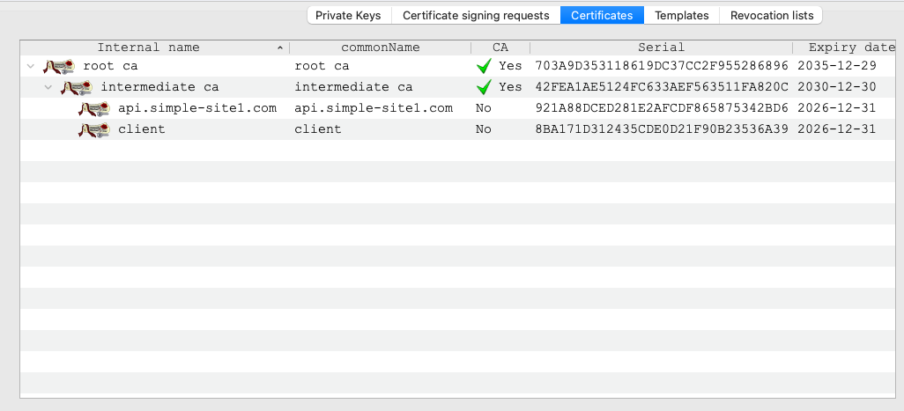

# PoC: simple PKI using terraform (opentofu)

Simple TLS Public Key Infrastructure (PKI) generator using Terraform/OpenTofu with automatic certificate rotation capabilities.

## Overview

This project creates a certificate authority with a root CA and intermediate CA using Terraform or OpenTofu.
It also creates and sign server and client certificates. 

